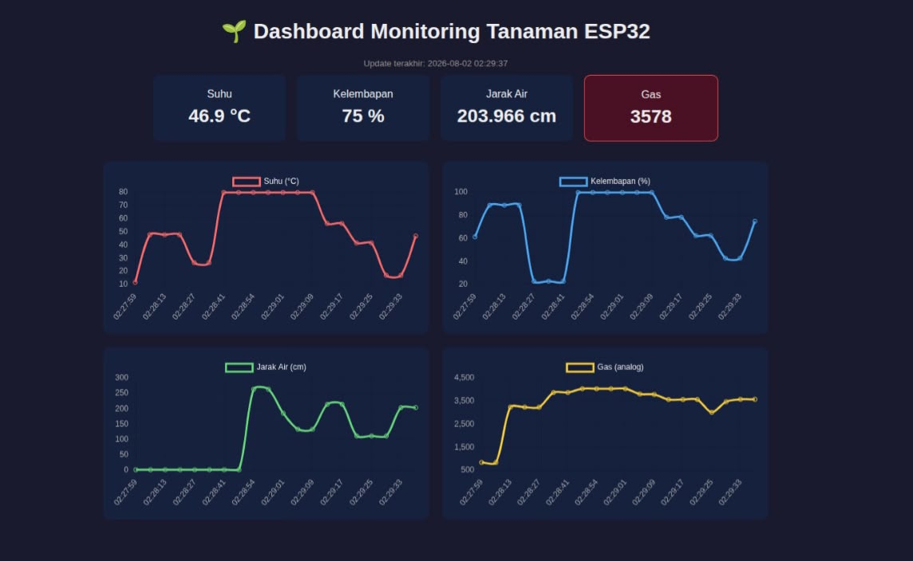
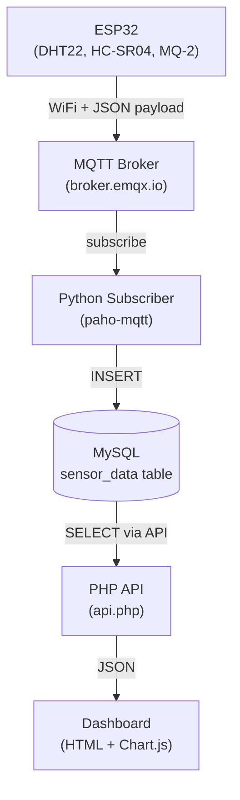

# 🌱 ESP32 IoT Plant Monitoring System

An end-to-end IoT pipeline built to learn and demonstrate the core protocols and data infrastructure used in real-world IoT/ML engineering: **sensor acquisition → MQTT messaging → database persistence → real-time dashboard visualization**.

This project was built as a hands-on learning exercise, simulating an ESP32-based plant monitoring system on [Wokwi](https://wokwi.com/), then extending it with a full backend data pipeline.

---

## 📷 Dashboard Review



> *Real-time dashboard visualizing sensor data (temperature, humidity, water level, and gas levels) fetched via PHP API from the MySQL database.*

---

## 🔌 Wiring Diagram


> *Hardware schematic connecting the ESP32 to the DHT22 (Temperature/Humidity), HC-SR04 (Ultrasonic/Water Level), MQ-2 (Gas/Smoke), and an I2C 16x2 LCD.*

---

## 🧠 Overview

The system reads environmental data from three simulated sensors, displays it locally on an LCD, and simultaneously publishes it over MQTT so it can be stored and visualized remotely — the same architectural pattern used in production IoT systems.

**Why MQTT instead of writing straight to a database from the device?**
Because embedded devices are resource-constrained and often have unreliable connectivity. MQTT decouples the device from the storage layer: the ESP32 only needs to publish a small JSON payload to a broker, without knowing (or needing credentials for) the database, and without breaking if the connection drops mid-write. This also lets multiple consumers — a database writer, a dashboard, or later a ML anomaly-detection service — subscribe to the same data stream independently.

### Architecture



---

## ✨ Features & Results Achieved

- **Multi-sensor acquisition** — Successfully reading temperature & humidity (DHT22), water level via distance (HC-SR04), and gas/smoke detection (MQ-2).
- **Local display** — Rotating 16x2 LCD screens implemented, including a priority alert screen triggered when smoke is detected.
- **Non-blocking sensor loop** — Achieved smooth concurrent operations using `millis()` instead of `delay()`.
- **MQTT publishing** — Reliable transmission of sensor readings as JSON over WiFi.
- **Persistent storage** — Automated data logging into MySQL via a custom Python MQTT subscriber.
- **Live web dashboard** — Fully functional web interface with auto-refreshing stat cards and line charts (Chart.js), complete with visual danger indicators for gas safety thresholds.

---

## 🛠️ Tech Stack

| Layer | Technology |
|---|---|
| Microcontroller | ESP32 (simulated on [Wokwi](https://wokwi.com/)) |
| Firmware | C++ (Arduino framework), PlatformIO |
| Sensors | DHT22, HC-SR04, MQ-2, 16x2 I2C LCD |
| Messaging | MQTT (`PubSubClient` + `ArduinoJson` on device, `paho-mqtt` on the subscriber) |
| Database | MySQL (via XAMPP) |
| Subscriber / bridge | Python 3 (`paho-mqtt`, `mysql-connector-python`) |
| Backend API | PHP (`mysqli`) |
| Dashboard | HTML, JavaScript, [Chart.js](https://www.chartjs.org/) |

---

## 📁 Project Structure

```text
.
├── firmware/                  # PlatformIO project (ESP32 code)
│   ├── src/
│   │   └── main.cpp
│   ├── platformio.ini
│   ├── diagram.json           # Wokwi wiring diagram
│   └── wokwi.toml
├── subscriber/                # MQTT → MySQL bridge
│   └── subscriber.py
├── dashboard/                 # Web dashboard
│   ├── api.php
│   └── index.html
├── .gitignore
└── README.md
```

> Note: the folders above reflect a suggested layout. Adjust paths in `subscriber.py` and the PlatformIO project as needed if your local structure differs.

---

## 🚀 Getting Started

### Prerequisites

- [VS Code](https://code.visualstudio.com/) with the [PlatformIO](https://platformio.org/) extension (or the [Wokwi VS Code extension](https://wokwi.com/vscode) for simulation)
- [XAMPP](https://www.apachefriends.org/) (Apache + MySQL + PHP)
- Python 3.8+

### 1. Firmware (ESP32 / Wokwi)

1. Open the `firmware/` folder in VS Code with PlatformIO.
2. Install dependencies (already declared in `platformio.ini`):
   ```ini
   lib_deps =
       marcoschwartz/LiquidCrystal_I2C@^1.1.4
       adafruit/DHT sensor library@^1.4.6
       adafruit/Adafruit Unified Sensor@^1.1.14
       knolleary/PubSubClient@^2.8
       bblanchon/ArduinoJson@^6.21.3
   ```
3. In `main.cpp`, set a **unique MQTT topic** (the broker used is a shared public broker, so a generic topic name may collide with other users):
   ```cpp
   const char* mqtt_topic = "iot_monitoring/<your_unique_id>/sensor";
   ```
4. Run the Wokwi simulation from VS Code, or build/flash to real hardware.

### 2. Database (MySQL via XAMPP)

1. Start **Apache** and **MySQL** from the XAMPP control panel.
2. Open `http://localhost/phpmyadmin`, create a database (e.g. `iot_monitoring`).
3. Run the schema:
   ```sql
   CREATE TABLE sensor_data (
     id INT AUTO_INCREMENT PRIMARY KEY,
     device_id VARCHAR(50),
     suhu FLOAT,
     kelembapan FLOAT,
     jarak_air FLOAT,
     gas_value INT,
     waktu TIMESTAMP DEFAULT CURRENT_TIMESTAMP
   );
   ```

### 3. Subscriber (MQTT → MySQL)

```bash
cd subscriber
python3 -m venv venv
source venv/bin/activate
pip install paho-mqtt mysql-connector-python
```

Update the broker, topic, and database credentials at the top of `subscriber.py` to match your setup, then run:

```bash
python3 subscriber.py
```

Keep this running — it listens continuously and writes each incoming reading to MySQL.

### 4. Dashboard

Copy the `dashboard/` folder into your XAMPP `htdocs` directory (e.g. `/opt/lampp/htdocs/iot-dashboard`), then visit:

```text
http://localhost/iot-dashboard/
```

The dashboard polls `api.php` every 3 seconds and updates the stat cards and charts automatically.

### Run order

Start components in this order so no data is missed:

1. XAMPP (Apache + MySQL)
2. `subscriber.py`
3. Wokwi simulation (or physical device)
4. Open the dashboard in your browser

---

## 📊 Data Schema

| Column | Type | Description |
|---|---|---|
| `id` | INT | Auto-increment primary key |
| `device_id` | VARCHAR(50) | Identifier of the reporting device |
| `suhu` | FLOAT | Temperature (°C) |
| `kelembapan` | FLOAT | Humidity (%) |
| `jarak_air` | FLOAT | Distance reading used as a water-level proxy (cm) |
| `gas_value` | INT | Raw analog reading from the MQ-2 gas sensor |
| `waktu` | TIMESTAMP | Server-assigned insert time |

---

## 📝 Notes & Limitations

- This project runs on **Wokwi's simulated sensors**, which return semi-randomized values rather than real physical readings — expect erratic-looking temperature/distance values during simulation; this is expected and not a bug in the pipeline.
- The MQTT broker used (`broker.emqx.io`) is a **public test broker** — fine for learning, but not suitable for production or private data. A self-hosted broker (e.g. Mosquitto) would be the next step for a real deployment.
- Credentials in `subscriber.py` (DB user/password) are for local development only; do not commit real credentials to version control.

---

## 📚 What I Learned

Building this project was primarily a way to understand, hands-on, why IoT systems are architected the way they are — in particular:

- The difference between an **application-layer protocol** (MQTT) and a **transport medium** (WiFi, Ethernet, cellular) — MQTT works over any of them.
- Why devices publish to a **broker** instead of writing directly to a database (resource constraints, connection reliability, security, and decoupling of data producers from consumers).
- Designing and implementing a simple but complete **time-series data pipeline**, from sensor acquisition, backend parsing, persistent storage, all the way to frontend visualization.

---

## 📄 License

This project is open source under the [MIT License](LICENSE).

---

## 👤 Author

**Moh. Ilham Ramadan (Rama)** *Telecommunication Engineering, Politeknik Elektronika Negeri Surabaya (PENS)* Embedded Systems, IoT & Machine Learning Enthusiast

- GitHub: [@ramailham23](https://github.com/ramailham23)
